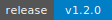

# AWX MCP

[](https://github.com/vhspace/awx-mcp/actions/workflows/ci.yml)
[](https://github.com/vhspace/awx-mcp/releases)
[](https://www.python.org/downloads/)
[](https://github.com/vhspace/awx-mcp/blob/main/LICENSE)
[](https://github.com/astral-sh/ruff)

A [Model Context Protocol](https://modelcontextprotocol.io/) (MCP) server for **Ansible AWX / Automation Controller**.

Provides AI agents with tools to launch jobs, query inventories, manage credentials, and monitor workflows through a minimal generic CRUD interface — plus guided prompts for common workflows and resources for context loading.

> Works with both AWX (community edition) and Automation Controller (enterprise).

---

## Quick Start

### Install from PyPI

```bash
uvx awx-mcp
```

### Cursor

Add to `.cursor/mcp.json`:

```json
{
  "mcpServers": {
    "awx": {
      "command": "uvx",
      "args": ["awx-mcp"],
      "env": {
        "AWX_HOST": "https://your-awx.example.com/",
        "AWX_TOKEN": "your-awx-token"
      }
    }
  }
}
```

Or for local development:

```json
{
  "mcpServers": {
    "awx": {
      "command": "uv",
      "args": ["--directory", "/absolute/path/to/awx-mcp", "run", "awx-mcp"],
      "env": {
        "AWX_HOST": "https://your-awx.example.com/",
        "AWX_TOKEN": "your-awx-token"
      }
    }
  }
}
```

### Claude Desktop / Claude Code

```bash
claude mcp add --transport stdio awx \
  -- uvx awx-mcp
```

Or via `fastmcp install`:

```bash
fastmcp install cursor awx-mcp
```

---

## Prompts

Pre-built guided workflows that encode domain expertise:

| Prompt | Parameters | Description |
|--------|-----------|-------------|
| `triage_failed_job` | `job_id` | Step-by-step failed job investigation (events, stdout, summary) |
| `launch_deployment` | `template_name` | Find template, review survey, set vars, launch |
| `check_cluster_health` | — | Ping, cluster status, metrics, and health summary |
| `investigate_host` | `hostname` | Cross-MCP: NetBox lookup → AWX job event investigation |

## Resources

| URI | Description |
|-----|-------------|
| `awx://resource-capabilities` | Supported resource types and CRUD capabilities |
| `health://awx` | Server health and uptime |
| `awx://jobs/{job_id}` | Job status and details (subscribable for notifications) |

## Tools

### Generic CRUD (6 tools)

Covers **25+ resource types** (credentials, job_templates, inventories, projects, organizations, teams, hosts, etc.) with one consistent interface:

| Tool | Description |
|------|-------------|
| `awx_list_supported_resources` | Discover resource types and their capabilities |
| `awx_list_resources` | List any resource with filtering, pagination, field selection, nesting |
| `awx_get_resource` | Get resource by ID with optional property sub-paths |
| `awx_create_resource` | Create resources (including nested) |
| `awx_update_resource` | Update resources (PATCH for credentials/schedules, PUT otherwise) |
| `awx_delete_resource` | Delete resources |

### Job Operations (8 tools)

| Tool | Description |
|------|-------------|
| `awx_launch` | Launch a job/workflow template (fire-and-forget) |
| `awx_launch_and_wait` | **Launch and poll until completion** with progress notifications |
| `awx_wait_for_job` | Poll an existing job with progress notifications |
| `awx_get_job_stdout` | Get job output (txt/ansi/json/html, line ranges, truncation) |
| `awx_cancel_job` | Cancel a running job |
| `awx_relaunch_job` | Relaunch with optional host limits |
| `awx_bulk_cancel_jobs` | Cancel multiple jobs |
| `awx_bulk_delete_jobs` | Delete multiple jobs |

### System & Health (5 tools)

| Tool | Description |
|------|-------------|
| `awx_ping` | Test connectivity |
| `awx_get_me` | Current user info |
| `awx_get_system_info` | Aggregated system info with progress logging |
| `awx_get_system_metrics` | Job counts and active/failed stats |
| `awx_get_cluster_status` | Cluster health with progress logging |

### Actions (7 tools)

| Tool | Description |
|------|-------------|
| `awx_update_project` | Sync project from SCM |
| `awx_cancel_project_update` | Cancel SCM sync |
| `awx_sync_inventory_source` | Sync dynamic inventory |
| `awx_pull_execution_environment` | Pull container image |
| `awx_test_credential` | Test credential connectivity |
| `awx_copy_credential` | Copy credential |
| `awx_update_system_setting` | Update system config |

### Helpers (7 tools)

| Tool | Description |
|------|-------------|
| `awx_debug_job_template_credentials` | Debug credentials with resolved type names |
| `awx_list_aws_like_credentials` | Find AWS credentials (parallel fetch) |
| `awx_get_workflow_visualization` | Build workflow graph structure |
| `awx_create_notification` | Create notification template |
| `awx_attach_notification_to_template` | Attach notification to events |
| `awx_detach_notification_from_template` | Remove notification |
| `awx_test_notification` | Test notification |

---

## Integration with NetBox MCP

Hostnames resolved via the **netbox-mcp-server** can be passed directly to AWX tools:

```python
# NetBox MCP returns hostname "b65c909e-41.cloud.together.ai"
awx_launch_and_wait("job_template", 174, limit="b65c909e-41.cloud.together.ai")
```

The `investigate_host` prompt automates this cross-MCP workflow.

---

## Configuration

Settings are loaded from CLI args, environment variables, or `.env` files. The server reads from `awx-mcp/.env` and `../.env` automatically.

**Precedence**: CLI > env vars > `.env` > defaults

| Setting | Default | Required | Description |
|---------|---------|----------|-------------|
| `AWX_HOST` | — | Yes | AWX/Controller URL (also: `CONTROLLER_HOST`) |
| `AWX_TOKEN` | — | Yes | PAT token (also: `CONTROLLER_OAUTH_TOKEN`) |
| `API_BASE_PATH` | `/api/v2` | No | API base path |
| `TRANSPORT` | `stdio` | No | `stdio` or `http` |
| `HOST` | `127.0.0.1` | If HTTP | Bind host |
| `PORT` | `8000` | If HTTP | Bind port |
| `MCP_HTTP_ACCESS_TOKEN` | — | If HTTP | Token for HTTP transport auth |
| `VERIFY_SSL` | `true` | No | TLS verification |
| `TIMEOUT_SECONDS` | `30` | No | HTTP client timeout |
| `LOG_LEVEL` | `INFO` | No | Logging level |

### Security Notes

- Never commit `.env` files or MCP configs with real tokens to version control
- For HTTP transport, always set `MCP_HTTP_ACCESS_TOKEN`
- Use tokens with minimal required AWX RBAC permissions

---

## Development

```bash
uv sync --all-groups

# Run
uv run awx-mcp

# Test
uv run pytest tests/ -v

# Lint + format
uv run ruff check src/ tests/ --fix
uv run ruff format src/ tests/

# Type check
uv run mypy src/awx_mcp
```

See [E2E_TESTING.md](E2E_TESTING.md) for testing against real AWX instances.

---

## Production Notes

- **Retry logic**: Transient errors (429, 502, 503, 504) are retried with exponential backoff
- **Connection pooling**: Single `httpx.Client` reused across requests
- **Token security**: Use dedicated tokens with minimal RBAC permissions
- **HTTP transport**: Requires `MCP_HTTP_ACCESS_TOKEN`; use TLS proxy if binding to `0.0.0.0`
- **Progress notifications**: Long-running tools emit MCP progress events for client visibility
- **Resource subscriptions**: Clients can subscribe to `awx://jobs/{id}` for push updates during polling

---

## Documentation

- **[TOOL_EXAMPLES.md](./TOOL_EXAMPLES.md)** — Practical examples and common workflows
- **[E2E_TESTING.md](./E2E_TESTING.md)** — End-to-end testing guide
- **[CHANGELOG.md](./CHANGELOG.md)** — Release history

---

## License

Apache-2.0
