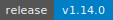

# MAAS MCP

[](https://github.com/vhspace/maas-mcp/actions/workflows/ci.yml)
[](https://github.com/vhspace/maas-mcp/releases)
[](https://www.python.org/downloads/)
[](https://opensource.org/licenses/Apache-2.0)
[](https://github.com/vhspace/maas-mcp/releases)
[](https://github.com/astral-sh/ruff)

A [Model Context Protocol](https://modelcontextprotocol.io/) server for **Canonical MAAS** (Metal as a Service). Manage bare-metal servers, BMC credentials, and configuration drift directly from LLM-powered tools.

## Agents and operators

Prefer **supported entry points** — this repo’s **MCP tools** and **`maas-cli`** — over ad-hoc scripts that import `maas_mcp` internals. Those scripts skip the same multi-instance configuration, 404 handling, and documented behavior that operators and agents depend on.

- **Token use**: For large machine lists, `maas-cli` is often cheaper than many MCP round-trips.
- **NetBox + MAAS**: Set `NETBOX_URL` and `NETBOX_TOKEN` so MCP tools and `maas-cli` can accept a **NetBox device name** and resolve it through `custom_fields.Provider_Machine_ID` to the MAAS hostname / `system_id`.
- **Full agent guide**: See [`AGENTS.md`](AGENTS.md) for detailed guidance on when to use CLI vs MCP vs library.

### Auto-resolve NetBox device names

When `NETBOX_URL` and `NETBOX_TOKEN` are set, CLI and MCP tools auto-resolve NetBox device names to MAAS system_id via `custom_fields.Provider_Machine_ID`:

```bash
maas-cli resolve research-common-h100-001      # test resolution
maas-cli machine research-common-h100-001      # auto-resolves on 404
maas-cli op research-common-h100-001 deploy --osystem ubuntu --distro-series jammy --yes
```

### Deploy with OS selection

```bash
maas-cli op <system_id> deploy --osystem ubuntu --distro-series jammy --yes
maas-cli op <system_id> deploy --osystem ubuntu --distro-series jammy --preflight-cache --yes
maas-cli verify-image-cache --os ubuntu --series jammy
```

### `GET /api/2.0/machines/` query parameters

| Parameter | Notes |
|-----------|--------|
| **`status`** | Many controllers require **numeric** `NodeStatus` (integers 0–22). Passing display strings such as `Ready` often returns **HTTP 400**. This project **coerces** common names (`ready`, `deployed`, …) and numeric strings before calling MAAS. Use **`maas-cli node-status-values`** or MCP **`maas_node_status_values`** for the full table. |
| **`hostname`** | Exact match only. NetBox **tenant / device names** are not MAAS hostnames unless you use NetBox-assisted resolution (env vars above). |
| **`zone`** | Availability zone name. |
| **`pool`** | Resource pool name. |
| **`tag`** | Tag name. |
| **`limit`** | Some MAAS builds reject `limit=` on the machines collection (`No such constraint`). Prefer narrowing with `hostname`, `status`, or `tag`. |

See also [Cross-MCP integration](#cross-mcp-integration). Upstream enum: [`NodeStatus`](https://github.com/canonical/maas/blob/master/src/maascommon/enums/node.py) in the MAAS tree.

## Quick Install

### Cursor (one-click)

[](https://cursor.com/install-mcp?name=maas&config=eyJjb21tYW5kIjoidXYiLCJhcmdzIjpbIi0tZGlyZWN0b3J5IiwiL3BhdGgvdG8vbWFhcy1tY3Atc2VydmVyIiwicnVuIiwibWFhcy1tY3Atc2VydmVyIl0sImVudiI6eyJNQUFTX1VSTCI6Imh0dHBzOi8vbWFhcy5leGFtcGxlLmNvbS9NQUFTIiwiTUFBU19BUElfS0VZIjoiY29uc3VtZXI6dG9rZW46c2VjcmV0In19)

> Update `/path/to/maas-mcp` with your local clone path and set your MAAS URL and API token.

### Claude Code (one command)

```bash
claude mcp add --transport stdio maas \
  --env MAAS_URL=https://maas.example.com/MAAS \
  --env MAAS_API_KEY=consumer:token:secret \
  -- uv --directory /path/to/maas-mcp run maas-mcp
```

Use `--scope project` to share via `.mcp.json`, or `--scope user` for all projects.

### Manual Setup

```bash
cd maas-mcp
uv sync
cp env.example .env   # edit with your MAAS credentials
uv run maas-mcp
```

## Tools

### Machines

| Tool | R/W | Description |
|------|:---:|-------------|
| `maas_status` | R | Check connectivity, version, list all configured instances |
| `maas_list_machines` | R | List machines with optional filters and field selection |
| `maas_node_status_values` | R | Reference table: numeric `NodeStatus` codes for `status` filters |
| `maas_get_machine` | R | Full details by `system_id` or `machine_id`; batch sub-requests with `include` |
| `maas_set_machine_power_parameters` | W | Update BMC power address/user/pass in MAAS |
| `maas_run_machine_op` | W | Lifecycle ops: commission, deploy, release, power_on/off/cycle, mark_broken/fixed |
| `maas_list_events` | R | Query the MAAS event stream by hostname |

### BMC / Redfish

| Tool | R/W | Description |
|------|:---:|-------------|
| `maas_list_bmc_accounts_redfish` | R | List Redfish BMC user accounts |
| `maas_create_bmc_account_redfish` | W | Create a Redfish BMC account with IPMI setup |
| `maas_set_bmc_account_password_from_maas` | W | Set BMC password via Redfish, optionally sync to MAAS |
| `maas_check_bmc_health` | R | Full health check: existence, lock, role, IPMI, password |

### Networking & Auditing

| Tool | R/W | Description |
|------|:---:|-------------|
| `maas_list_network` | R | List zones, fabrics, subnets, vlans, or dns_resources |
| `maas_audit_config` | R | Compare NIC/storage/BIOS between machines to detect drift |

> All write tools require `allow_write=true` and are annotated with `destructiveHint`.

## Resources

| URI | Description |
|-----|-------------|
| `maas://instances` | All configured MAAS instances with URLs and versions |
| `maas://config` | Non-secret configuration summary |
| `maas://{instance}/machines` | Machine list for an instance (hostname, status, power) |
| `maas://{instance}/machine/{system_id}` | Full machine detail |
| `maas://{instance}/events` | Recent events |

## Prompts

| Prompt | Description |
|--------|-------------|
| `investigate_machine` | Investigate health and config of a MAAS machine |
| `audit_drift` | Compare config between baseline and target machines |
| `sync_bmc_credentials` | Sync BMC credentials between MAAS and Redfish |

Prompt arguments support auto-completion for `system_id` and `hostname`.

## Configuration

### Single Instance

```env
MAAS_URL=https://maas.example.com/MAAS
MAAS_API_KEY=consumer_key:consumer_token:secret
```

### Multiple Instances

```env
MAAS_INSTANCES='{"prod": {"url": "https://maas-prod.example.com/MAAS", "api_key": "key:token:secret"}, "dev": {"url": "https://maas-dev.example.com/MAAS", "api_key": "key:token:secret"}}'
```

### Full Reference

| Setting | Default | Description |
|---------|---------|-------------|
| `MAAS_URL` | — | Base URL of MAAS instance |
| `MAAS_API_KEY` | — | API key (`key:token:secret`) |
| `MAAS_INSTANCES` | — | JSON dict of named instances |
| `NETBOX_URL` | — | NetBox URL (optional cross-ref) |
| `NETBOX_TOKEN` | — | NetBox API token |
| `TRANSPORT` | `stdio` | `stdio` or `http` |
| `HOST` | `127.0.0.1` | Bind host (HTTP mode) |
| `PORT` | `8000` | Bind port (HTTP mode) |
| `MCP_HTTP_ACCESS_TOKEN` | — | Bearer token for HTTP transport |
| `VERIFY_SSL` | `true` | Verify TLS certs |
| `TIMEOUT_SECONDS` | `30` | HTTP client timeout |
| `LOG_LEVEL` | `INFO` | Logging level |

## MCP Client Configuration

### Cursor / VS Code

Add to `.cursor/mcp.json`:

```json
{
  "mcpServers": {
    "maas": {
      "command": "uv",
      "args": ["--directory", "/path/to/maas-mcp", "run", "maas-mcp"],
      "env": {
        "MAAS_URL": "https://maas.example.com/MAAS",
        "MAAS_API_KEY": "consumer:token:secret"
      }
    }
  }
}
```

### Claude Desktop

Add to `claude_desktop_config.json`:

```json
{
  "mcpServers": {
    "maas": {
      "command": "uv",
      "args": ["--directory", "/path/to/maas-mcp", "run", "maas-mcp"],
      "env": {
        "MAAS_URL": "https://maas.example.com/MAAS",
        "MAAS_API_KEY": "consumer:token:secret"
      }
    }
  }
}
```

## Remote Deployment (HTTP / Kubernetes)

```bash
# Direct HTTP
uv run maas-mcp --transport http --host 0.0.0.0 --port 8000

# Production (ASGI)
uv run uvicorn maas_mcp.server:create_app --factory --host 0.0.0.0 --port 8000

# Docker
docker build -t maas-mcp .
docker run -p 8000:8000 -e MAAS_URL=... -e MAAS_API_KEY=... -e MCP_HTTP_ACCESS_TOKEN=... maas-mcp

# Kubernetes
kubectl apply -k deploy/k8s/
```

Connect remote clients with a Bearer token:

```json
{
  "mcpServers": {
    "maas": {
      "url": "https://maas-mcp.internal.example.com/mcp",
      "headers": { "Authorization": "Bearer my-secret-token" }
    }
  }
}
```

## Cross-MCP Integration

| MCP Server | Role | Integration |
|------------|------|-------------|
| **netbox-mcp-server** | Infrastructure source of truth | Look up hostnames/IPs, pass `system_id` to MAAS tools |
| **redfish-mcp** | Direct BMC access | Firmware, BIOS settings beyond account management |

Typical workflow: **NetBox lookup** → **MAAS machine details** → **BMC health check** → **remediation**

## Development

```bash
uv sync --all-groups
uv run ruff check src/ tests/
uv run ruff format --check src/ tests/
uv run mypy src/
uv run pytest -v
```

## License

[Apache-2.0](https://opensource.org/licenses/Apache-2.0)
