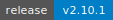

<!-- mcp-name: io.github.vhspace/netbox-mcp -->

# NetBox MCP Server

[](https://github.com/vhspace/netbox-mcp/actions/workflows/smoke-test.yml)
[](https://github.com/vhspace/netbox-mcp/releases)
[](https://github.com/vhspace/netbox-mcp/actions/workflows/test.yml)
[](https://www.python.org/downloads/)
[](https://opensource.org/licenses/Apache-2.0)
[](https://modelcontextprotocol.io)
[](https://github.com/vhspace/netbox-mcp/releases)

A read-only [Model Context Protocol](https://modelcontextprotocol.io/) server for [NetBox](https://netbox.dev/). Query your infrastructure data -- devices, IPs, sites, racks, VLANs, and more -- directly from LLMs that support MCP.

## Features

| Category | What You Get |
|----------|-------------|
| **5 Tools** | Device lookup, filtered queries, global search, changelogs, object-by-ID |
| **4 Resource Templates** | Browse `netbox://device/{hostname}`, `netbox://site/{slug}`, `netbox://ip/{address}`, `netbox://rack/{site}/{name}` |
| **3 Static Resources** | Object type catalog, server info, health check |
| **5 Workflow Prompts** | Investigate device, audit site, troubleshoot connectivity, inventory report, find available IPs |
| **Structured Output** | JSON schemas on tool responses for reliable LLM parsing |
| **Token Optimization** | Field filtering reduces responses by 80-90% |
| **Cross-MCP Ready** | Central lookup for Redfish, MAAS, and AWX MCP servers |

## Quick Start

### Cursor

[](https://cursor.com/install-mcp?name=netbox&config=eyJjb21tYW5kIjoidXYiLCJhcmdzIjpbIi0tZGlyZWN0b3J5IiwiL3BhdGgvdG8vbmV0Ym94LW1jcCIsInJ1biIsIm5ldGJveC1tY3AiXSwiZW52Ijp7Ik5FVEJPWF9VUkwiOiJodHRwczovL3lvdXItbmV0Ym94LmV4YW1wbGUuY29tLyIsIk5FVEJPWF9UT0tFTiI6InlvdXItYXBpLXRva2VuIn19)

After clicking, update `/path/to/netbox-mcp` and set your NetBox URL and API token.

### Claude Code

```bash
claude mcp add --transport stdio netbox \
  --env NETBOX_URL=https://your-netbox.example.com/ \
  --env NETBOX_TOKEN=your-api-token \
  -- uv --directory /path/to/netbox-mcp run netbox-mcp
```

### Claude Desktop

Add to `~/Library/Application Support/Claude/claude_desktop_config.json`:

```json
{
    "mcpServers": {
        "netbox": {
            "command": "uv",
            "args": ["--directory", "/path/to/netbox-mcp", "run", "netbox-mcp"],
            "env": {
                "NETBOX_URL": "https://netbox.example.com/",
                "NETBOX_TOKEN": "your-api-token"
            }
        }
    }
}
```

## Tools

| Tool | Description |
|------|-------------|
| `netbox_lookup_device` | **Recommended** -- Resolve a hostname to IPs (primary + OOB) in one call. Returns `oob_ip_address` for Redfish/BMC access. |
| `netbox_get_objects` | Query any object type with filters, pagination, ordering, and field projection. |
| `netbox_get_object_by_id` | Get a single object by its numeric ID. |
| `netbox_get_changelogs` | Audit trail / change history with time and user filters. |
| `netbox_search_objects` | Global search across devices, sites, IPs, VLANs, and more. Reports progress per type. |

> Supported object types are limited to core NetBox objects and won't work with plugin types.

## Resources & Templates

### Static Resources

| URI | Description |
|-----|-------------|
| `netbox://object-types` | All supported object types and API endpoints (for LLM discovery) |
| `netbox://server-info` | Server version, tools, and configuration |
| `netbox://health` | Health check with uptime and NetBox API connectivity |

### Resource Templates

| URI Pattern | Description |
|-------------|-------------|
| `netbox://device/{hostname}` | Device details with enriched IP fields |
| `netbox://site/{slug}` | Site details by slug |
| `netbox://ip/{address}` | IP address record lookup |
| `netbox://rack/{site_slug}/{rack_name}` | Rack lookup by site and name |

## Prompts

| Prompt | Description |
|--------|-------------|
| `investigate_device(hostname)` | Device investigation: status, interfaces, IPs, site context |
| `audit_site(site_name)` | Site audit: devices, racks, VLANs, prefixes, utilization |
| `troubleshoot_connectivity(device_a, device_b)` | Trace connectivity path between two devices |
| `inventory_report(site_name)` | Inventory summary: devices by role/type, rack utilization |
| `find_available_ips(prefix)` | Find allocated and available IPs within a prefix |

## Cross-MCP Integration

This server is the **central lookup service** for infrastructure MCPs. Other servers depend on it for hostname and IP resolution.

```text
# Redfish MCP -- always use oob_ip, NOT primary_ip
> netbox_lookup_device("gpu-node-01")  →  oob_ip_address: "192.168.196.12"
> redfish_get_info(host="192.168.196.12", ...)

# MAAS MCP -- use hostname or primary_ip
> netbox_lookup_device("compute-node-05")  →  primary_ip4_address: "10.20.30.40"
> maas_get_machines(hostname="compute-node-05")
```

## Configuration

Configuration precedence: **CLI > Environment > .env file > Defaults**

| Setting | Default | Required | Description |
|---------|---------|----------|-------------|
| `NETBOX_URL` | -- | Yes | Base URL of your NetBox instance |
| `NETBOX_TOKEN` | -- | Yes | API token for authentication |
| `TRANSPORT` | `stdio` | No | `stdio` or `http` |
| `HOST` | `127.0.0.1` | If HTTP | HTTP server bind address |
| `PORT` | `8000` | If HTTP | HTTP server port |
| `VERIFY_SSL` | `true` | No | Verify SSL certificates |
| `MCP_HTTP_ACCESS_TOKEN` | -- | No | Bearer token for HTTP transport auth |
| `LOG_LEVEL` | `INFO` | No | Logging verbosity |
| `LOG_JSON` | `false` | No | JSON-formatted log output (for containers) |

### Example .env

```env
NETBOX_URL=https://netbox.example.com/
NETBOX_TOKEN=your_api_token_here
LOG_LEVEL=INFO
```

### CLI

```bash
uv run netbox-mcp --help
uv run netbox-mcp --log-level DEBUG --no-verify-ssl   # Development
uv run netbox-mcp --transport http --port 9000        # HTTP mode
```

## HTTP Transport (Production)

For production and multi-tenant deployments, run the server in HTTP mode using the ASGI factory with uvicorn:

```bash
# Direct (for development)
uv run netbox-mcp --transport http --host 0.0.0.0 --port 8000

# Production (ASGI factory with uvicorn)
NETBOX_URL=https://netbox.example.com/ \
NETBOX_TOKEN=your-api-token \
uvicorn netbox_mcp.server:create_app --factory --host 0.0.0.0 --port 8000
```

The MCP endpoint is at `/mcp` and a health check is at `/health`.

### Access Token Authentication

Set `MCP_HTTP_ACCESS_TOKEN` to require clients to authenticate with a bearer token:

```bash
export MCP_HTTP_ACCESS_TOKEN=my-secret-token
```

Clients must then send `Authorization: Bearer my-secret-token` or `X-API-Key: my-secret-token`.

### CORS

The ASGI factory (`create_app`) includes CORS middleware that exposes the `mcp-session-id` header, which is required for browser-based MCP clients like Cursor.

## Docker

```bash
docker build -t netbox-mcp:latest .

# HTTP mode (default for containers)
docker run --rm \
  -e NETBOX_URL=https://netbox.example.com/ \
  -e NETBOX_TOKEN=your-api-token \
  -e TRANSPORT=http \
  -p 8000:8000 \
  netbox-mcp:latest

# stdio mode
docker run --rm -i \
  -e NETBOX_URL=https://netbox.example.com/ \
  -e NETBOX_TOKEN=your-api-token \
  -e TRANSPORT=stdio \
  netbox-mcp:latest
```

The HTTP server is accessible at `http://localhost:8000/mcp`.

## Kubernetes (Helm)

A Helm chart is provided in `chart/`:

```bash
helm install netbox-mcp ./chart \
  --set netbox.url=https://netbox.example.com/ \
  --set netbox.token=your-api-token \
  --set mcpHttpAccessToken=your-mcp-token
```

Or with an existing secret:

```bash
kubectl create secret generic netbox-mcp-creds \
  --from-literal=NETBOX_TOKEN=your-api-token \
  --from-literal=MCP_HTTP_ACCESS_TOKEN=your-mcp-token

helm install netbox-mcp ./chart \
  --set netbox.url=https://netbox.example.com/ \
  --set existingSecret=netbox-mcp-creds
```

The chart configures health/readiness probes on `/health`, resource limits, and supports custom environment variables via `extraEnv`.

## Field Filtering (Token Optimization)

Use the `fields` parameter on any query tool to reduce token usage by 80-90%:

```python
# Full response: ~5000 tokens
netbox_get_objects('dcim.device', {'site_id': 1})

# With fields: ~500 tokens
netbox_get_objects('dcim.device', {'site_id': 1}, fields=['id', 'name', 'status', 'site'])
```

## Development

```bash
uv sync --all-groups          # Install dependencies (includes mcp-common)
uv run pytest -v              # Run tests
uv run ruff check src/ tests/ # Lint
uv run ruff format src/ tests/ # Format
uv run mypy src/              # Type check
```

This project uses [conventional commits](https://www.conventionalcommits.org/) for automated versioning via `python-semantic-release`.

## License

[Apache 2.0](LICENSE)
