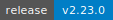

# Redfish MCP Server

[](https://github.com/vhspace/redfish-mcp/actions/workflows/ci.yml)
[](https://github.com/vhspace/redfish-mcp/releases)
[](https://www.python.org/downloads/)
[](LICENSE)
[](https://spec.modelcontextprotocol.io)
[](https://github.com/jlowin/fastmcp)

Model Context Protocol (MCP) server for managing Redfish-enabled BMCs (Supermicro, Dell, HPE, Lenovo). Provides BIOS, firmware, boot, and inventory management for data center hardware through a safe-by-default tool interface designed for AI agent workflows.

## Quick Start

### Cursor IDE

Add to `.cursor/mcp.json`:

```json
{
  "mcpServers": {
    "redfish-mcp": {
      "command": "uv",
      "args": ["--directory", "/path/to/redfish-mcp", "run", "redfish-mcp"],
      "env": { "REDFISH_SITE": "default" }
    }
  }
}
```

### Claude Code

```bash
claude mcp add redfish-mcp -- uv --directory /path/to/redfish-mcp run redfish-mcp
```

### From Source

```bash
curl -LsSf https://astral.sh/uv/install.sh | sh
cd redfish-mcp
uv sync --all-groups
uv run redfish-mcp
```

## Runtime dependencies

The KVM console feature (phase 2+) requires four system binaries in addition
to Python and `uv`:

- `openjdk-17-jre-headless` — Java runtime for the Supermicro iKVM client.
- `openjdk-11-jdk` — supplies `unpack200`, required to decode the compressed iKVM JAR that newer Supermicro X13 firmware serves (`jnlp.packEnabled=true`). The tool was removed in Java 14+, so we pin to Java 11 for this purpose even though the JRE we actually run the JAR under is Java 17.
- `xvfb` — headless X display server.
- `x11vnc` — exports the X display as a local VNC stream.

**Ubuntu / Debian** (x86_64 and aarch64):
```bash
sudo apt install -y openjdk-17-jre-headless openjdk-11-jdk xvfb x11vnc
```

**macOS** (Homebrew; caveat: `xvfb` / `x11vnc` on macOS require XQuartz and are
less polished than on Linux):
```bash
brew install openjdk
# Xvfb/x11vnc via XQuartz; see docs/KVM_CONSOLE_FEATURE.md
```

Without these binaries, the daemon exits on startup with a clear error. Non-KVM
features (screenshot via Redfish/CGI, BIOS, firmware, power) work without them.

## Tools

### Read Operations (8 tools)

| Tool | Description |
|------|-------------|
| `redfish_get_info` | Unified system information -- system, boot, BIOS, drives, pending changes |
| `redfish_query` | Targeted queries for specific settings -- BIOS attributes, boot, power, health, NICs |
| `redfish_diff_bios_settings` | Compare BIOS attributes between two hosts with smart semantic matching |
| `redfish_list_bmc_users` | List BMC/IPMI user accounts from AccountService |
| `redfish_get_firmware_inventory` | All firmware versions -- BIOS, BMC, NICs, GPUs, PSUs, CPLDs, storage |
| `redfish_get_hardware_docs` | Hardware documentation, BIOS changelog, GPU optimization tips (cached 24h) |
| `redfish_check_bios_online` | Check vendor website for latest BIOS version |
| `redfish_get_vendor_errata` | Security bulletin and CVE links for detected hardware vendor |

### Write Operations (3 tools)

All write tools require `allow_write=true` and run as async MCP tasks by default.

| Tool | Description |
|------|-------------|
| `redfish_set_nextboot` | Set boot override target (BIOS, PXE, HDD, etc.) with optional reboot |
| `redfish_set_bios_attributes` | Stage BIOS attribute changes (requires reboot to apply) |
| `redfish_update_firmware` | Upload and apply firmware via UpdateService with task polling |

### Agent Coordination (3 tools)

| Tool | Description |
|------|-------------|
| `redfish_agent_report_observation` | Store an observation about a host for later reuse (local SQLite) |
| `redfish_agent_list_observations` | Retrieve stored observations for a host |
| `redfish_agent_get_host_stats` | Per-host tool-call statistics (calls, errors, top tools) |

### Resources, Prompts & Completions

- **Resources:** `redfish://hardware-db/list`, `redfish://hardware-db/{vendor}/{model}`, `redfish://health`
- **Prompts:** `investigate_host`, `compare_hosts`, `prepare_firmware_update`
- **Completions:** Autocomplete for hardware DB vendor/model and prompt host arguments

## Safety Model

- All writes require explicit `allow_write=true`
- Firmware updates require `preserve_bmc_settings=true` or explicit `allow_non_preserving_update=true`
- Write tools support `execution_mode="render_curl"` to preview equivalent curl commands
- Concurrency limiter: 1 concurrent request per BMC, 16 global
- Credential elicitation: prompts for missing credentials via MCP elicitation protocol
- MCP logging and progress notifications for long-running operations

## Cross-MCP Integration

Designed to work alongside other MCP servers in Together AI's SRE stack:

- **netbox-mcp-server** -- Resolve hostnames to OOB IPs for Redfish access
- **awx-mcp-server** -- Trigger Ansible playbooks after BIOS/firmware changes
- **tavily-mcp** -- `redfish_check_bios_online` provides instructions for Tavily-based firmware checking

## Configuration

| Variable | Default | Description |
|----------|---------|-------------|
| `REDFISH_SITE` | `default` | Site identifier for observation store |
| `REDFISH_STATE_DIR` | `~/.cache/redfish-mcp` | SQLite state directory |
| `REDFISH_HINTING_ENABLED` | `0` | Enable LLM-based hints (experimental) |
| `TOGETHER_INFERENCE_KEY` | -- | Together API key (for hinting) |
| `REDFISH_HINTING_MODEL` | `Qwen/Qwen3-235B-A22B-Instruct-2507-tput` | Hint generation model |
| `REDFISH_ELICIT_CACHE_TTL_S` | `900` | Credential cache TTL in seconds |

## Development

```bash
uv sync --all-groups
uv run pytest -v -m "not integration"   # Unit tests
uv run ruff check src/ tests/ --fix     # Lint
uv run ruff format src/ tests/          # Format
uv run mypy src/                        # Type check
uv build                                # Build package
```

Integration tests require a real Redfish endpoint:

```bash
export REDFISH_IP=192.168.196.54
export REDFISH_USER=admin
export REDFISH_PASSWORD=yourpassword
uv run pytest -m integration -v
```

Credential priority (highest to lowest):
1. CLI flags: `--user` / `--password`
2. Explicit env vars: `REDFISH_USER` / `REDFISH_PASSWORD`
3. Vendor auto-detection: site-specific credentials matched by IP range

For multi-site or host-scoped credentials, you can also use prefixed variables:

```bash
export HOST_REDFISH_USER=admin
export HOST_REDFISH_PASSWORD=yourpassword
export ORI_REDFISH_USER=admin
export ORI_REDFISH_PASSWORD=yourpassword
```

## Documentation

- [AI Agent Guide](./AI_AGENT_GUIDE.md) -- Quick reference for AI agents
- [Hardware Database](./hardware_db/) -- JSON hardware profiles
- [Docs Index](./docs/DOCUMENTATION_INDEX.md) -- Full documentation
- [Changelog](./CHANGELOG.md) -- Version history

## License

Apache 2.0


## Releasing

Trigger releases from the GitHub Actions `Release` workflow after merges to `main`.
