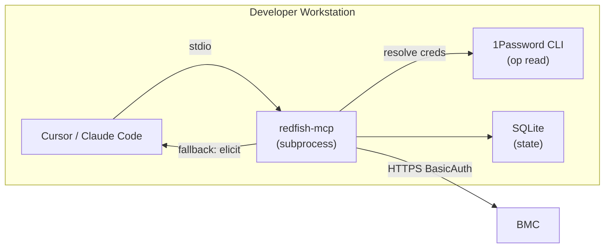
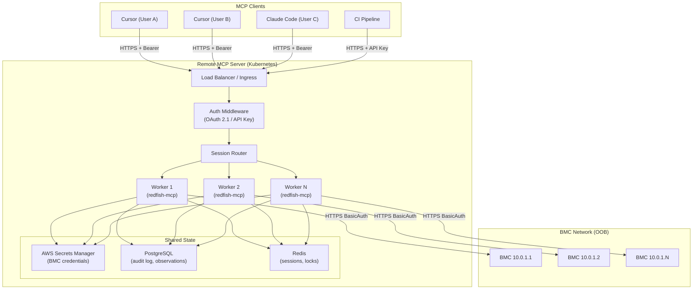

# Remote Multi-User Redfish MCP: Architecture Design

**Status:** Draft v2
**Date:** 2026-02-25
**Decisions:** Both local + remote modes; AWS Secrets Manager (remote), 1Password (local); Elicitation local-only; WebSocket yes; mTLS to BMC deferred.

## Problem Statement

The current redfish-mcp server runs as a **local stdio process** -- one instance per user, launched by Cursor or Claude Code as a subprocess. This works for single-user local development but doesn't scale to:

- **Shared infrastructure teams** where 5-20 engineers manage the same fleet of BMCs
- **CI/CD pipelines** that need Redfish access without per-runner MCP installs
- **Centralized credential management** instead of every user storing BMC passwords locally
- **Audit logging** of who did what to which BMC and when
- **Rate limiting** across all users to protect fragile BMCs from concurrent abuse

## Two Operating Modes

The same codebase runs in two modes, selected by `REDFISH_TRANSPORT`:

| | Local Mode | Remote Mode |
|---|---|---|
| **Transport** | stdio (default) | Streamable HTTP + WebSocket |
| **Auth** | None (process-level trust) | OAuth 2.1 / API keys |
| **BMC Credentials** | 1Password (`op` CLI) + elicitation fallback | AWS Secrets Manager |
| **State** | SQLite (per-process) | PostgreSQL + Redis |
| **Concurrency** | asyncio.Semaphore (per-process) | Redis distributed locks |
| **Elicitation** | Yes (ask user for missing creds) | No (hard-fail if secret missing) |
| **Users** | 1 | Many (per-session isolation) |

## Architecture

### Local Mode (Current + 1Password)



### Remote Mode (Multi-User)



## Credential Resolution

### The `CredentialResolver` Interface

A pluggable interface that the `AgentController` calls instead of hardcoding elicitation or env vars:

```python
from abc import ABC, abstractmethod
from dataclasses import dataclass

@dataclass(frozen=True)
class BMCCredentials:
    user: str
    password: str
    source: str  # "1password", "aws_secrets_manager", "elicitation", "env"

class CredentialResolver(ABC):
    @abstractmethod
    async def resolve(self, host: str, site: str) -> BMCCredentials | None:
        """Resolve BMC credentials for a host. Return None if not found."""

    @abstractmethod
    def supports_elicitation_fallback(self) -> bool:
        """Whether to fall back to MCP elicitation if resolve() returns None."""
```

### Local: 1Password Resolver

Uses the `op` CLI (1Password CLI) to read secrets. The user must be signed in to 1Password (`op signin` or the desktop app).

```python
class OnePasswordResolver(CredentialResolver):
    """
    Reads BMC credentials from 1Password using secret references.

    Secret naming convention in 1Password:
      Vault: "Infrastructure"
      Item:  "BMC - {site}" or "BMC - {host}"
      Fields: "username", "password"

    Secret reference format:
      op://Infrastructure/BMC - ori/username
      op://Infrastructure/BMC - ori/password
    """

    def __init__(self, vault: str = "Infrastructure"):
        self.vault = vault

    async def resolve(self, host: str, site: str) -> BMCCredentials | None:
        # Try host-specific first, then site-wide fallback
        for item_name in [f"BMC - {host}", f"BMC - {site}"]:
            user = await self._op_read(f"op://{self.vault}/{item_name}/username")
            password = await self._op_read(f"op://{self.vault}/{item_name}/password")
            if user and password:
                return BMCCredentials(user=user, password=password, source="1password")
        return None

    def supports_elicitation_fallback(self) -> bool:
        return True  # Local mode: ask user if 1Password lookup fails

    async def _op_read(self, ref: str) -> str | None:
        proc = await asyncio.create_subprocess_exec(
            "op", "read", ref,
            stdout=asyncio.subprocess.PIPE,
            stderr=asyncio.subprocess.PIPE,
        )
        stdout, _ = await proc.communicate()
        if proc.returncode != 0:
            return None
        return stdout.decode().strip()
```

**Setup for users:**

```bash
# Install 1Password CLI
brew install --cask 1password-cli   # macOS
# or: sudo apt install 1password-cli  # Linux

# Sign in (once, cached by desktop app)
op signin

# Create a site-wide BMC credential in 1Password:
#   Vault: Infrastructure
#   Item name: "BMC - ori"
#   Fields: username = "taiuser", password = "..."

# Or per-host overrides:
#   Item name: "BMC - 10.0.1.5"
```

**Cursor/Claude config for local + 1Password:**

```json
{
  "mcpServers": {
    "redfish-mcp": {
      "command": "uv",
      "args": ["--directory", "/path/to/redfish-mcp", "run", "redfish-mcp"],
      "env": {
        "REDFISH_SITE": "ori",
        "REDFISH_CRED_RESOLVER": "1password",
        "REDFISH_1P_VAULT": "Infrastructure"
      }
    }
  }
}
```

### Remote: AWS Secrets Manager Resolver

Uses boto3 to read secrets from AWS Secrets Manager. No user interaction -- the server's IAM role has permission.

```python
class AWSSecretsResolver(CredentialResolver):
    """
    Reads BMC credentials from AWS Secrets Manager.

    Secret naming convention:
      redfish/{site}/{host}  -- host-specific
      redfish/{site}/_default  -- site-wide fallback

    Secret value (JSON):
      {"username": "taiuser", "password": "..."}

    Caching: secrets are cached in-memory for REDFISH_SECRET_CACHE_TTL_S
    (default: 300s / 5 min) to reduce API calls.
    """

    def __init__(self, region: str | None = None, cache_ttl_s: int = 300):
        import boto3
        self._client = boto3.client("secretsmanager", region_name=region)
        self._cache: dict[str, tuple[BMCCredentials, float]] = {}
        self._cache_ttl_s = cache_ttl_s

    async def resolve(self, host: str, site: str) -> BMCCredentials | None:
        # Check cache first
        now = time.monotonic()
        for secret_id in [f"redfish/{site}/{host}", f"redfish/{site}/_default"]:
            cached = self._cache.get(secret_id)
            if cached and (now - cached[1]) < self._cache_ttl_s:
                return cached[0]

            creds = await self._fetch(secret_id)
            if creds:
                self._cache[secret_id] = (creds, now)
                return creds
        return None

    def supports_elicitation_fallback(self) -> bool:
        return False  # Remote mode: never elicit, hard-fail

    async def _fetch(self, secret_id: str) -> BMCCredentials | None:
        try:
            resp = await asyncio.to_thread(
                self._client.get_secret_value, SecretId=secret_id
            )
            data = json.loads(resp["SecretString"])
            return BMCCredentials(
                user=data["username"],
                password=data["password"],
                source="aws_secrets_manager",
            )
        except Exception:
            return None
```

**AWS Secrets Manager setup:**

```bash
# Create site-wide default credential
aws secretsmanager create-secret \
  --name "redfish/ori/_default" \
  --secret-string '{"username":"taiuser","password":"..."}'

# Create host-specific override (optional)
aws secretsmanager create-secret \
  --name "redfish/ori/10.0.1.5" \
  --secret-string '{"username":"admin","password":"..."}'
```

**IAM policy for the MCP server:**

```json
{
  "Effect": "Allow",
  "Action": "secretsmanager:GetSecretValue",
  "Resource": "arn:aws:secretsmanager:*:*:secret:redfish/*"
}
```

### Env Var Resolver (Fallback for Both Modes)

For simple setups or CI where neither 1Password nor AWS SM is available:

```python
class EnvVarResolver(CredentialResolver):
    """
    Reads BMC credentials from environment variables.

    REDFISH_USER and REDFISH_PASSWORD -- used for all hosts.
    REDFISH_USER_{SITE} and REDFISH_PASSWORD_{SITE} -- site-specific.
    """

    async def resolve(self, host: str, site: str) -> BMCCredentials | None:
        site_upper = site.upper().replace("-", "_")
        user = os.getenv(f"REDFISH_USER_{site_upper}") or os.getenv("REDFISH_USER")
        password = os.getenv(f"REDFISH_PASSWORD_{site_upper}") or os.getenv("REDFISH_PASSWORD")
        if user and password:
            return BMCCredentials(user=user, password=password, source="env")
        return None

    def supports_elicitation_fallback(self) -> bool:
        return True  # Can be used in local mode
```

### Resolver Chain

The `AgentController` uses a chain of resolvers in priority order:

```python
class ChainedResolver(CredentialResolver):
    def __init__(self, resolvers: list[CredentialResolver]):
        self.resolvers = resolvers

    async def resolve(self, host: str, site: str) -> BMCCredentials | None:
        for resolver in self.resolvers:
            creds = await resolver.resolve(host, site)
            if creds:
                return creds
        return None

    def supports_elicitation_fallback(self) -> bool:
        return any(r.supports_elicitation_fallback() for r in self.resolvers)
```

**Local mode chain:** `1Password -> EnvVar -> Elicitation`
**Remote mode chain:** `AWS Secrets Manager -> EnvVar -> hard-fail`

Configuration via env var:

```
REDFISH_CRED_RESOLVER=1password     # Local: 1Password + elicitation fallback
REDFISH_CRED_RESOLVER=aws           # Remote: AWS Secrets Manager, no elicitation
REDFISH_CRED_RESOLVER=env           # Simple: env vars only
```

## Transport: Streamable HTTP + WebSocket

### Streamable HTTP (Primary)

The MCP 2025-11-25 spec standard. Single endpoint, POST for requests, optional SSE for streaming responses.

```
https://redfish-mcp.internal.together.ai/mcp
```

### WebSocket (Supplementary)

WebSocket is not yet in the MCP spec but is proposed (SEP-1287). We add it as a custom transport for clients that prefer persistent bidirectional connections. It shares the same JSON-RPC message format.

```
wss://redfish-mcp.internal.together.ai/ws
```

**Why both?**
- Streamable HTTP works with all MCP clients today (Cursor, Claude Code)
- WebSocket is better for long-lived sessions (e.g., monitoring a firmware update for 30+ minutes) -- no HTTP connection timeouts, true bidirectional push
- The server handles both on the same process; messages route to the same tool handlers

```python
# FastMCP supports both via ASGI
app = mcp.http_app()  # Serves /mcp (Streamable HTTP) and /ws (WebSocket)

# Or with explicit WebSocket route:
from starlette.websockets import WebSocket

@mcp.custom_route("/ws", methods=["WEBSOCKET"])
async def websocket_handler(websocket: WebSocket):
    await websocket.accept()
    # JSON-RPC over WebSocket, same message format as Streamable HTTP
```

**Note:** Until the MCP spec finalizes WebSocket, we treat it as experimental. Streamable HTTP is the default and recommended transport.

## Authentication

### Remote: OAuth 2.1 + API Keys

Same as v1 design. OAuth for interactive users, API keys for CI.

### Local: No Auth

stdio transport implies process-level trust. No authentication needed.

## Session & State

### Remote Mode

| Component | Backend | Purpose |
|-----------|---------|---------|
| Sessions | Redis (TTL: 4h) | MCP session tracking, keyed by `MCP-Session-Id` |
| Concurrency locks | Redis (TTL: 30s-3600s) | Per-host BMC locks, prevents multi-user collision |
| Observations | PostgreSQL | Agent observations, tagged with `user_id` |
| Audit log | PostgreSQL | Every tool call with user identity |
| Secret cache | In-memory (TTL: 5min) | Cache AWS Secrets Manager responses |

### Local Mode

| Component | Backend | Purpose |
|-----------|---------|---------|
| Sessions | In-process | Single user, single session |
| Concurrency locks | asyncio.Semaphore | Per-host, per-process |
| Observations | SQLite | Same as current |
| Audit log | SQLite | Same as current `tool_call_events` |
| Secret cache | In-memory (TTL: 15min) | Cache 1Password / elicited creds |

## AgentController Changes

The `AgentController` is the central hook point. It needs to be mode-aware:

```python
class AgentController:
    def __init__(
        self,
        *,
        mode: Literal["local", "remote"],
        credential_resolver: CredentialResolver,
        state_store: AgentStateStore,         # SQLite or Postgres
        concurrency_limiter: ConcurrencyLimiter,  # local or distributed
    ):
        self._mode = mode
        self._cred_resolver = credential_resolver
        self._store = state_store
        self._limiter = concurrency_limiter

    async def _maybe_pre_elicit(self, ...):
        # Step 1: Try resolver chain
        creds = await self._cred_resolver.resolve(host, site)
        if creds:
            args["user"] = creds.user
            args["password"] = creds.password
            return args

        # Step 2: Elicitation (local mode only)
        if self._cred_resolver.supports_elicitation_fallback():
            # ... existing elicitation flow ...
            return args

        # Step 3: Hard-fail (remote mode)
        return CallToolResult(
            content=[TextContent(type="text", text=(
                f"No BMC credentials found for host {host} (site: {site}). "
                f"Add credentials to AWS Secrets Manager at redfish/{site}/{host} "
                f"or redfish/{site}/_default."
            ))],
            isError=True,
            structuredContent={"ok": False, "error": "no credentials", "host": host},
        )
```

## Concurrency: Mode-Aware Limiter

```python
class ConcurrencyLimiter(ABC):
    @abstractmethod
    async def acquire(self, host: str, timeout_s: int = 30) -> bool: ...

    @abstractmethod
    async def release(self, host: str) -> None: ...

class LocalConcurrencyLimiter(ConcurrencyLimiter):
    """Current asyncio.Semaphore approach."""

class RedisConcurrencyLimiter(ConcurrencyLimiter):
    """Distributed lock via Redis SET NX EX."""

    async def acquire(self, host: str, timeout_s: int = 30) -> bool:
        key = f"redfish:lock:{host}"
        deadline = time.monotonic() + timeout_s
        while time.monotonic() < deadline:
            if await self._redis.set(key, self._worker_id, nx=True, ex=timeout_s):
                return True
            await asyncio.sleep(0.5)
        return False

    async def release(self, host: str) -> None:
        key = f"redfish:lock:{host}"
        # Only release if we hold the lock (Lua script for atomicity)
        await self._redis.eval(
            "if redis.call('get', KEYS[1]) == ARGV[1] then return redis.call('del', KEYS[1]) end",
            1, key, self._worker_id,
        )
```

## Implementation Plan

### Phase 1: Credential Resolver Abstraction (Week 1)

Extract credential handling from `AgentController._maybe_pre_elicit` into the `CredentialResolver` interface. Implement all three resolvers (1Password, AWS, EnvVar) and the chain.

**Files changed:**
- New: `src/redfish_mcp/credential_resolver.py`
- Modified: `src/redfish_mcp/agent_controller.py` (use resolver before elicitation)
- Modified: `src/redfish_mcp/mcp_server.py` (wire resolver from env config)
- New: `tests/test_credential_resolver.py`

**Result:** Local mode immediately benefits from 1Password integration. No transport changes yet.

### Phase 2: HTTP + WebSocket Transport (Week 2)

Add Streamable HTTP and WebSocket transports alongside stdio.

**Files changed:**
- Modified: `src/redfish_mcp/mcp_server.py` (add `REDFISH_TRANSPORT` switch)
- New: `src/redfish_mcp/ws_transport.py` (WebSocket custom transport)
- New: `Dockerfile`, `docker-compose.yml`
- Modified: `scripts/install-cursor.sh` (add HTTP URL config option)
- Modified: `scripts/install-claude-code.sh` (add HTTP URL config option)

**Result:** Server can run as HTTP endpoint. WebSocket at `/ws`. Still single-user (no auth).

### Phase 3: Auth + Per-User Isolation (Week 3)

Add OAuth 2.1 and API key auth. Extract user identity into `AgentController`.

**Dependencies:** `mcpauth` library, identity provider (Okta/Cognito)

**Files changed:**
- New: `src/redfish_mcp/auth.py` (OAuth middleware, API key validation)
- Modified: `src/redfish_mcp/agent_controller.py` (user identity from JWT)
- Modified: `src/redfish_mcp/mcp_server.py` (auth middleware wiring)

### Phase 4: Distributed State (Week 4)

Replace SQLite and in-memory state with PostgreSQL and Redis for remote mode.

**Files changed:**
- New: `src/redfish_mcp/backends/postgres_store.py`
- New: `src/redfish_mcp/backends/redis_limiter.py`
- Modified: `src/redfish_mcp/agent_state_store.py` (pluggable backend interface)
- Modified: `src/redfish_mcp/jobs.py` (pluggable limiter)
- New: `migrations/` (Alembic or raw SQL for Postgres schema)

### Phase 5: Kubernetes Deployment (Week 5)

Helm chart, ingress, NetworkPolicy, Prometheus metrics.

## Client Configuration Summary

### Local + 1Password

```json
{
  "mcpServers": {
    "redfish-mcp": {
      "command": "uv",
      "args": ["--directory", "/path/to/redfish-mcp", "run", "redfish-mcp"],
      "env": {
        "REDFISH_SITE": "ori",
        "REDFISH_CRED_RESOLVER": "1password",
        "REDFISH_1P_VAULT": "Infrastructure"
      }
    }
  }
}
```

### Local + Env Vars (Simple)

```json
{
  "mcpServers": {
    "redfish-mcp": {
      "command": "uv",
      "args": ["--directory", "/path/to/redfish-mcp", "run", "redfish-mcp"],
      "env": {
        "REDFISH_SITE": "ori",
        "REDFISH_USER": "taiuser",
        "REDFISH_PASSWORD": "..."
      }
    }
  }
}
```

### Remote (Cursor with OAuth)

```json
{
  "mcpServers": {
    "redfish-mcp": {
      "url": "https://redfish-mcp.internal.together.ai/mcp",
      "auth": {
        "type": "oauth",
        "issuer": "https://together.okta.com",
        "clientId": "redfish-mcp-cursor",
        "scopes": ["redfish:read", "redfish:write"]
      }
    }
  }
}
```

### Remote (Claude Code with API Key)

```bash
claude mcp add redfish-mcp \
  --transport http \
  --url https://redfish-mcp.internal.together.ai/mcp \
  --header "Authorization: Bearer $REDFISH_API_KEY"
```

### Remote (CI Pipeline)

```yaml
- name: Check BMC firmware
  env:
    MCP_URL: https://redfish-mcp.internal.together.ai/mcp
    MCP_API_KEY: ${{ secrets.REDFISH_MCP_API_KEY }}
  run: |
    curl -X POST $MCP_URL \
      -H "Authorization: Bearer $MCP_API_KEY" \
      -H "Content-Type: application/json" \
      -d '{"jsonrpc":"2.0","method":"tools/call","params":{"name":"redfish_get_info","arguments":{"host":"10.0.1.5","info_types":["system"]}},"id":1}'
```

## Environment Variables Reference

| Variable | Default | Mode | Description |
|----------|---------|------|-------------|
| `REDFISH_TRANSPORT` | `stdio` | Both | Transport: `stdio`, `http` |
| `REDFISH_HTTP_HOST` | `0.0.0.0` | Remote | HTTP bind address |
| `REDFISH_HTTP_PORT` | `8000` | Remote | HTTP bind port |
| `REDFISH_SITE` | `default` | Both | Site tag for state/credentials |
| `REDFISH_CRED_RESOLVER` | `env` | Both | Resolver: `1password`, `aws`, `env` |
| `REDFISH_1P_VAULT` | `Infrastructure` | Local | 1Password vault name |
| `REDFISH_SECRET_CACHE_TTL_S` | `300` | Remote | AWS SM cache TTL |
| `REDFISH_DATABASE_URL` | (none) | Remote | PostgreSQL connection string |
| `REDFISH_REDIS_URL` | (none) | Remote | Redis connection string |
| `REDFISH_OAUTH_ISSUER` | (none) | Remote | OAuth issuer URL |
| `REDFISH_OAUTH_AUDIENCE` | `redfish-mcp` | Remote | OAuth audience |
| `REDFISH_USER` | (none) | Both | Fallback BMC username |
| `REDFISH_PASSWORD` | (none) | Both | Fallback BMC password |

## Resolved Questions

1. **Credential source:** AWS Secrets Manager (remote), 1Password (local), env vars (fallback both)
2. **Tenant isolation:** TBD -- start with single-deployment multi-site via `REDFISH_SITE`
3. **Elicitation:** Local mode only, as last-resort fallback after 1Password/env lookup
4. **WebSocket:** Yes, as supplementary transport at `/ws` alongside Streamable HTTP at `/mcp`
5. **mTLS to BMC:** Deferred. BasicAuth over HTTPS (with `verify_tls=false` for self-signed) is the current approach. If a use case arises, the `CredentialResolver` interface can be extended to return certificates instead of passwords.
