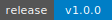

# Weka MCP Server

[](https://github.com/vhspace/weka-mcp/releases)
[](https://github.com/vhspace/weka-mcp/actions/workflows/ci.yml)
[](https://www.python.org/downloads/)
[](https://opensource.org/licenses/Apache-2.0)
[](https://docs.weka.io)

MCP server for [Weka](https://www.weka.io/) distributed storage. 13 tools cover the full Weka REST API v2 for both **converged** and **hosted** deployments.

## Design Philosophy

Instead of 40+ individual tools, this server uses a **generic list/get pattern** for reads and **specific tools for writes**:

- `weka_cluster_overview` — one call to understand cluster state
- `weka_list` / `weka_get` — read any resource type with one tool
- Specific tools for destructive/write operations (filesystem CRUD, snapshots, S3, alert management)

This keeps tool count low (13 total) while covering 19 API resource types.

## Tools

All tools support a `fields` parameter for response projection to reduce token usage.

### Read Tools (6)

| Tool | Description |
|------|-------------|
| `weka_cluster_overview` | One-shot: cluster status + active alerts (MAJOR/CRITICAL) + license info |
| `weka_list` | List any resource type (19 types: containers, drives, filesystems, snapshots, etc.) |
| `weka_get` | Get a single resource by UID (11 types) |
| `weka_get_events` | Query event log with severity/category/time filters |
| `weka_get_stats` | Cluster performance stats (historical or realtime) |
| `weka_list_quotas` | Directory quotas for a filesystem |

### Write Tools (7)

| Tool | Description | Risk |
|------|-------------|------|
| `weka_manage_alert` | Mute/unmute alert types during maintenance | Low |
| `weka_create_filesystem` | Create new filesystem with capacity and optional tiering | Medium |
| `weka_create_snapshot` | Create point-in-time snapshot (read-only or writable) | Low |
| `weka_upload_snapshot` | Upload snapshot to object storage for DR | Low |
| `weka_restore_filesystem` | Restore filesystem from object-store snapshot | Medium |
| `weka_manage_s3` | Create/update/delete S3 cluster | Medium-High |
| `weka_delete_resource` | Delete filesystems, snapshots, or S3 cluster | **Destructive** |

### Resource Types for `weka_list`

19 resource types available via the generic `weka_list` tool. Pass `filters` as key-value pairs forwarded as query parameters.

| Resource Type | API Endpoint | Useful Filters |
|---------------|--------------|----------------|
| `alerts` | `alerts` | `severity` (INFO, MINOR, MAJOR, CRITICAL) |
| `alert_types` | `alerts/types` | — |
| `alert_descriptions` | `alerts/description` | — |
| `containers` | `containers` | — |
| `drives` | `drives` | — |
| `events` | `events` | `severity`, `category`, `num_results`, `start_time`, `end_time` |
| `failure_domains` | `failureDomains` | — |
| `filesystem_groups` | `fileSystemGroups` | — |
| `filesystems` | `fileSystems` | — |
| `interface_groups` | `interfaceGroups` | — |
| `organizations` | `organizations` | — |
| `processes` | `processes` | — |
| `s3_buckets` | `s3/buckets` | — |
| `servers` | `servers` | — |
| `smb_shares` | `smb/shares` | — |
| `snapshot_policies` | `snapshotPolicy` | — |
| `snapshots` | `snapshots` | `filesystem_uid` |
| `tasks` | `tasks` | — |
| `users` | `users` | — |

### Resource Types for `weka_get`

11 resource types support single-resource lookup by UID.

| Resource Type | API Endpoint |
|---------------|--------------|
| `containers` | `containers/{uid}` |
| `drives` | `drives/{uid}` |
| `failure_domains` | `failureDomains/{uid}` |
| `filesystem_groups` | `fileSystemGroups/{uid}` |
| `filesystems` | `fileSystems/{uid}` |
| `organizations` | `organizations/{uid}` |
| `processes` | `processes/{uid}` |
| `servers` | `servers/{uid}` |
| `snapshot_policies` | `snapshotPolicy/{uid}` |
| `snapshots` | `snapshots/{uid}` |
| `users` | `users/{uid}` |

## Converged vs Hosted

Weka supports two deployment models. Different resource types are most relevant for each:

- **Converged** (storage co-located with compute/GPU nodes): Focus on `containers`, `drives`, `processes`, `failure_domains`, `weka_get_stats` — storage health directly impacts GPU workloads.
- **Hosted** (dedicated storage cluster): Focus on `filesystems`, `s3_buckets`, `smb_shares`, `interface_groups`, `organizations` — protocol health and multi-tenant isolation are the primary concerns.

## Cross-MCP Integration

This server works alongside other MCP servers in the SRE stack:

- **NetBox MCP** — Look up Weka node hostnames to get rack/site info. Container hostnames from `weka_list(resource="containers")` map to NetBox device records.
- **AWX MCP** — Trigger remediation playbooks for Weka issues (drive failures, node decommissioning).
- **Redfish MCP** — Check BMC health on converged Weka nodes. Use NetBox to look up the OOB IP, then query Redfish for hardware diagnostics.

## Local Testing with Mock Server

A Docker-based mock Weka API server is included for development and testing:

```bash
docker compose -f docker-compose.mock.yml up -d
WEKA_HOST=http://localhost:14000 WEKA_USERNAME=admin WEKA_PASSWORD=admin weka-mcp
```

**Note:** A real Weka cluster cannot run in Docker/VM — it requires bare-metal servers with NVMe drives, dedicated CPU cores, and InfiniBand/high-speed Ethernet.

## Installation

Requires Python 3.12+ and a Weka cluster with REST API enabled (port 14000).

```bash
uv add weka-mcp
# or
pip install weka-mcp
```

For development from source:

```bash
cd weka-mcp
uv sync --all-groups
```

## Configuration

### Environment Variables

Create a `.env` file (see `env.example`):

| Variable | Required | Default | Description |
|----------|----------|---------|-------------|
| `WEKA_HOST` | Yes | — | Weka cluster URL (e.g. `https://weka01:14000`) |
| `WEKA_USERNAME` | No | `admin` | Weka API username |
| `WEKA_PASSWORD` | Yes | — | Weka API password |
| `API_BASE_PATH` | No | `/api/v2` | Weka REST API base path |
| `VERIFY_SSL` | No | `true` | SSL certificate verification |
| `TIMEOUT_SECONDS` | No | `30` | HTTP client timeout in seconds |
| `LOG_LEVEL` | No | `INFO` | Logging level (DEBUG, INFO, WARNING, ERROR, CRITICAL) |
| `TRANSPORT` | No | `stdio` | MCP transport (`stdio` or `http`) |
| `HOST` | No | `127.0.0.1` | HTTP bind address (only when `TRANSPORT=http`) |
| `PORT` | No | `8000` | HTTP bind port (only when `TRANSPORT=http`) |
| `MCP_HTTP_ACCESS_TOKEN` | No* | — | Access token for HTTP transport (*required when `TRANSPORT=http`) |

Aliases: `WEKA_CLUSTER_HOST` for `WEKA_HOST`, `WEKA_USER` for `WEKA_USERNAME`, `WEKA_PASS` for `WEKA_PASSWORD`.

### Command Line

```bash
weka-mcp                                          # stdio (default)
weka-mcp --transport http --port 8000             # HTTP
weka-mcp --no-verify-ssl --log-level DEBUG        # development
```

## Cursor / Claude Code Integration

### Cursor (`.cursor/mcp.json` or `.mcp.json`)

```json
{
  "mcpServers": {
    "weka": {
      "command": "uv",
      "args": ["--directory", "/path/to/weka-mcp", "run", "weka-mcp"],
      "env": {
        "WEKA_HOST": "https://weka01:14000",
        "WEKA_USERNAME": "admin",
        "WEKA_PASSWORD": "your-password"
      }
    }
  }
}
```

### Claude Code (`settings.json`)

```json
{
  "mcpServers": {
    "weka": {
      "command": "uv",
      "args": ["--directory", "/path/to/weka-mcp", "run", "weka-mcp"],
      "env": {
        "WEKA_HOST": "https://weka01:14000",
        "WEKA_USERNAME": "admin",
        "WEKA_PASSWORD": "your-password"
      }
    }
  }
}
```

## Development

```bash
uv sync --all-groups
uv run ruff check src/ tests/
uv run ruff format src/ tests/
uv run pytest -v
uv run mypy src/
```

### Project Structure

```
src/weka_mcp/
├── config.py       # Pydantic Settings with env/CLI/file precedence
├── weka_client.py  # Synchronous httpx client with auto token refresh
└── server.py       # FastMCP tools (13 tools) and entrypoint
```

## Security

- Credentials are `SecretStr` and redacted in logs
- HTTP transport requires `MCP_HTTP_ACCESS_TOKEN` for authentication
- SSL verification enabled by default
- Never commit `.env` files with real credentials

## License

Apache License 2.0
