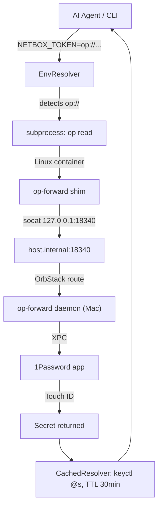

# Credential Chain Setup

This guide configures 1Password as a credential backend for mcpanvil's
credential chain. After setup, env vars like `NETBOX_TOKEN=op://Vault/Item/field`
resolve at runtime instead of requiring a plaintext token.

## Quick Verification

After setup, run the credential chain doctor:

```bash
uv run python -m mcpanvil.doctor
# or:
mcpanvil-doctor
```

Expected output: all checks pass. If any check fails, the doctor prints
a specific fix hint pointing back to the relevant section of this doc.
The doctor never prints credential values, so its output is safe to
share with an AI agent for triage.

## Choose Your Environment

| Environment | Method | Skip to |
|-------------|--------|---------|
| Linux devcontainer (macOS host) | op-forward | [Step 1: Devcontainer](#step-1-linux-devcontainer-on-macos-host) |
| Native macOS | Desktop app integration | [Step 2: Native macOS](#step-2-native-macos) |
| Headless / CI | Service account token | [Step 3: Headless](#step-3-headless--ci) |

## Step 1: Linux Devcontainer on macOS Host

### 1.1 Verify prerequisites

Run on macOS host:

```bash
op --version
```

Expected: `2.33.0` or higher. If `op` is missing:

```bash
brew install --cask 1password-cli
```

Verify desktop app integration is enabled:

```bash
defaults read com.1password.op cli-app-integration
```

Expected output: `1`

If output is `0`: Open 1Password app -> Settings -> Developer -> "Integrate with 1Password CLI" -> enable.

### 1.2 Install op-forward on macOS host

```bash
brew install ekovshilovsky/tap/op-forward
op-forward service install
```

Verify the daemon is running:

```bash
launchctl list | grep op-forward
```

Expected output (PID will differ):

```
12345  0  com.ekovshilovsky.op-forward
```

If the daemon is not listed, start it manually:

```bash
op-forward serve &
```

### 1.3 Add op-forward shim to devcontainer

Add to `.devcontainer/Dockerfile`:

```dockerfile
RUN curl -fsSL https://github.com/ekovshilovsky/op-forward/releases/latest/download/op-forward-linux-amd64 \
        -o /usr/local/bin/op-forward && \
    chmod +x /usr/local/bin/op-forward && \
    mv /usr/bin/op /usr/local/bin/op-real && \
    ln -s /usr/local/bin/op-forward /usr/bin/op && \
    apt-get update && apt-get install -y socat
```

### 1.4 Mount auth tokens and start socat relay

Add to `.devcontainer/devcontainer.json`:

```json
{
  "mounts": [
    "source=${localEnv:HOME}/Library/Caches/op-forward,target=/home/vscode/.cache/op-forward,type=bind"
  ],
  "postStartCommand": "socat TCP4-LISTEN:18340,bind=127.0.0.1,fork,reuseaddr TCP4:host.internal:18340 &"
}
```

### 1.5 Rebuild and verify

Rebuild the devcontainer (Cursor: command palette -> "Dev Containers: Rebuild Container").

Inside the container, verify the relay:

```bash
nc -z 127.0.0.1 18340 && echo "relay OK"
```

Expected: `relay OK`

Verify op CLI:

```bash
op account list
```

Expected: a table listing your 1Password accounts. The first call may trigger Touch ID on the macOS host.

Final verification with a real reference:

```bash
op read "op://Personal/Test/credential"
```

Expected: the secret value (one Touch ID prompt).

If `op account list` succeeds, setup is complete.

If you see `tunnel not available on port 18340`, the socat relay died. Restart it:

```bash
socat TCP4-LISTEN:18340,bind=127.0.0.1,fork,reuseaddr TCP4:host.internal:18340 &
```

## Step 2: Native macOS

### 2.1 Sign in to op CLI

```bash
op signin
```

Follow the prompts. Verify:

```bash
op account list
```

Expected: a table listing your 1Password accounts.

If sign-in fails, open 1Password app -> Settings -> Developer -> enable "Integrate with 1Password CLI", then retry.

### 2.2 Verify with a real reference

```bash
op read "op://Personal/Test/credential"
```

Expected: the secret value (Touch ID prompt the first time, cached afterward by the 1Password app).

Setup complete.

## Step 3: Headless / CI

### 3.1 Create a service account

In the 1Password web UI:

1. Navigate to **Developer** -> **Service Accounts** -> **New Service Account**
2. Name it (e.g., `ci-mcp-readonly`)
3. Grant read access to the required vaults
4. Set an expiry (e.g., 30 days)
5. Copy the token (starts with `ops_`)

### 3.2 Set environment variable

```bash
export OP_SERVICE_ACCOUNT_TOKEN="ops_..."
op vault list
```

Expected: a table listing the vaults granted to the service account.

```bash
op read "op://Vault/Item/field"
```

Expected: the secret value (no Touch ID; runs headless).

### 3.3 Configure CI

Add `OP_SERVICE_ACCOUNT_TOKEN` as a secret in your CI provider:

- **GitHub Actions**: Repository -> Settings -> Secrets and variables -> Actions -> New repository secret
- **GitLab CI**: Project -> Settings -> CI/CD -> Variables
- **Other**: Consult your CI provider's secret management docs

The 1Password CLI auto-detects the variable; no `op signin` is needed.

## Verification (All Environments)

After completing one of the setup paths above, verify the full credential chain works:

```bash
export NETBOX_TOKEN="op://Employee/NetBox/NETBOX_TOKEN"
netbox-cli search "test"
```

Expected timing:

- **First run:** 5-15 seconds (Touch ID + API call). On Linux devcontainers, biometric prompts appear on the macOS host.
- **Second run:** under 1 second (kernel keyring cache hit, no Touch ID).

If both runs return data without errors, setup is complete.

## Troubleshooting

| Symptom | Cause | Fix |
|---------|-------|-----|
| `op-forward: tunnel not available on port 18340` | socat relay died | Restart `postStartCommand` or run socat manually (see 1.5) |
| `You are not currently signed in` | No active session | Run `op signin` (macOS) or set `OP_SERVICE_ACCOUNT_TOKEN` (CI) |
| `Connection refused` on port 18340 | op-forward daemon not running | `op-forward service install` and verify with `launchctl list \| grep op-forward` |
| Multiple Touch ID prompts per session | Kernel keyring not used | Verify `keyctl` is installed; confirm `CachedResolver` wraps `EnvResolver` in the chain |
| `op read` works but mcpanvil fails | env var not visible to subprocess | Run `load_env()` at startup; verify `.env` location matches `search_from` |
| `request_key: Required key not available` | Wrong keyring scope | Use `@s` (session keyring), not `@u` (user keyring) — `CachedResolver` handles this automatically |

## How It Works



Subsequent calls within 30 minutes hit the kernel keyring cache directly — no Touch ID, no `op read`, no daemon round trip.

## Related Reading

- [mcpanvil README — Credential chain](../README.md#credential-chain)
- [op-forward GitHub](https://github.com/ekovshilovsky/op-forward)
- [1Password CLI docs](https://developer.1password.com/docs/cli/)
- [Linux kernel keyring (keyctl) man page](https://man7.org/linux/man-pages/man1/keyctl.1.html)
